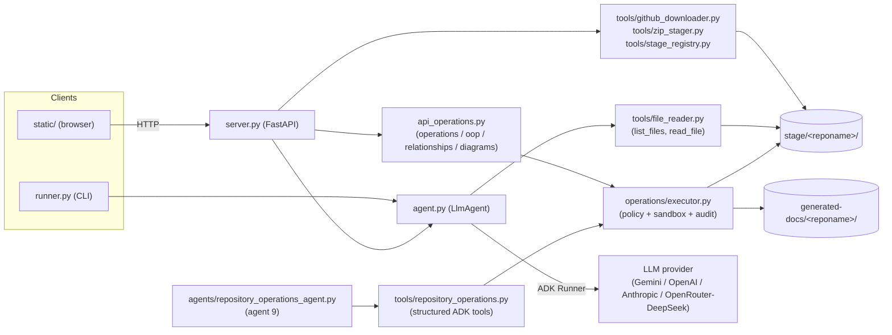
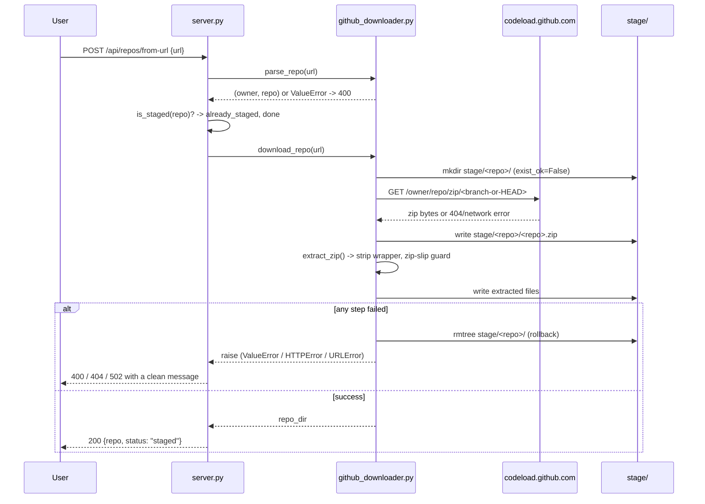
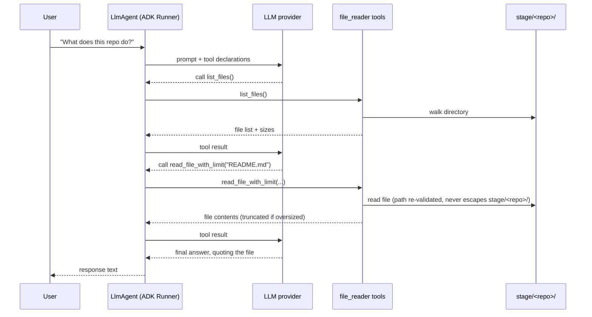
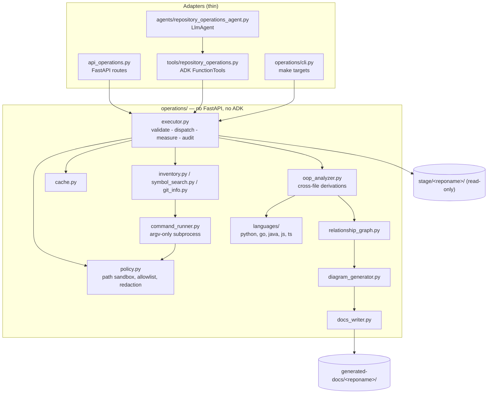

# zdocs-ai — Architecture & Business Logic

## 1. Purpose

zdocs-ai is a documentation/repository assistant. A user gives it a GitHub
repository — by URL or by uploading a `.zip` — and the system downloads,
extracts, and sandboxes that repo on local disk, then lets the user ask an
LLM-backed agent questions about it. The agent answers by calling tools that
list and read files from that one repo's directory; it never has access to
anything else on disk.

Two front doors exist over the same backend: a CLI ([runner.py](../runner.py))
and a small FastAPI web app with a vanilla HTML/JS frontend
([server.py](../server.py), [static/](../static/)).

## 2. High-level architecture



Three layers, deliberately decoupled:

| Layer | Files | Responsibility |
|---|---|---|
| **Entry points** | `runner.py`, `server.py` + `static/` | Accept user input (CLI args, HTTP requests), format output. No staging or agent logic of their own. |
| **Staging (ingestion)** | `tools/github_downloader.py`, `tools/zip_stager.py`, `tools/stage_registry.py` | Turn "a URL" or "an uploaded zip" into a validated, extracted directory under `stage/`. Pure filesystem operations — no LLM involvement. |
| **Agent (querying)** | `agent.py`, `tools/file_reader.py` | An ADK `LlmAgent` sandboxed to exactly one `stage/<reponame>/` directory, exposing `list_files`/`read_file` as tools the model calls itself. |
| **Operations (analysis)** | `operations/`, `agents/repository_operations_agent.py`, `tools/repository_operations.py`, `api_operations.py` | Deterministic, read-only repository analysis behind an enumerated operation contract: inventory, symbol search, OOP relationships, Mermaid diagrams. See §8. |

Staging and querying never share code paths. The agent layer only ever
receives a directory path (`build_agent(stage_dir=...)`); it has no idea
whether that directory came from a GitHub download or a manual upload.

## 3. Directory layout

```
agent.py                     LlmAgent definition (model, system prompt, tools)
runner.py                    CLI entry point + run_turn() (shared by server.py)
server.py                    FastAPI app: staging routes + chat route + static hosting
static/                      Vanilla HTML/CSS/JS frontend (no framework, no build step)
api_operations.py            FastAPI router for the Repository Operations Agent
agents/
  __init__.py                Registry of the agents that are actually implemented
  repository_operations_agent.py   Agent 9: controlled repository operations
operations/                  Analysis engine — no FastAPI, no ADK (see §8)
  schemas.py                 Pydantic contracts (OperationType, CodeMatch, ...)
  errors.py                  Recoverable failure types
  policy.py                  Path sandbox, executable allowlist, secret redaction
  command_runner.py          argv-only subprocess execution, timeout + output caps
  inventory.py               File discovery, counting, language detection
  symbol_search.py           Text search and bounded file reads
  git_info.py                Read-only git metadata
  sandbox.py                 Disposable container for the validation profile
  languages/                 Per-language analyzers behind one interface
    base.py                    Analyzer interface + lexical helpers (masking, brace matching)
    *_analyzer.py              Always-available lexical/ast analyzers
    tree_sitter_support.py     Optional tree-sitter loader, base class, receiver resolution
    *_tree_sitter.py           Preferred analyzers when a grammar is installed
  oop_analyzer.py            Repository-wide analysis + cross-file derivations
  relationship_graph.py      Resolved node/edge graph, limits, package grouping
  diagram_generator.py       Mermaid rendering: sanitizing, splitting, honesty
  docs_writer.py             generated-docs/<reponame>/ output
  cache.py                   Deterministic result cache (Null / JSON file)
  tool_detection.py          Which external tools are installed, and fallbacks
  cli.py                     `python -m operations.cli` — backs the make targets
tools/
  file_reader.py             Sandboxed list_files/read_file tools, bound to a stage_dir
  repository_operations.py   ADK FunctionTools wrapping the approved operations
  github_downloader.py       URL → zip → extracted files (zip-slip guarded)
  zip_stager.py              Uploaded zip bytes → extracted files (reuses the guard above)
  stage_registry.py          Read-side: list/lookup staged repos
stage/                       One subdirectory per staged repo; the agent's sandbox root
static/analysis.js           Browser panel for the operations API (Analysis tab)
generated-docs/              Analysis output, namespaced per repository (git-ignored)
requirements-analyzers.txt   Optional tree-sitter grammars
tests/fixtures/              Small per-language repositories used by the test suite
tests/ui_harness.mjs         Runs static/analysis.js under Node for the render tests
docker-compose.yml           Local dev dependency (MinIO — not yet wired into the app)
Makefile                     `make deps-up/run/test/...` — deps in Docker, app local
test_*.py, conftest.py       Offline, deterministic tests (no network, no LLM calls)
```

## 4. Business logic: staging a repository

"Staging" is the ingestion step — turning user input into files on disk that
the agent can later read. Two entry points converge on identical output.

### 4a. Stage by GitHub URL

`POST /api/repos/from-url` ([server.py](../server.py)) →
`tools/github_downloader.py`:



Business rules encoded here:
- **Only `github.com` URLs are accepted** — `parse_repo()` rejects wrong
  hosts, missing repo segments, sub-paths (`/tree/main`), and any `..`
  traversal attempt in the owner/repo segments.
- **Idempotent re-staging** — if the repo directory already exists, the
  route returns `already_staged` (200) instead of erroring, both via an
  up-front check and by catching the `FileExistsError` race.
- **No partial state on failure** — a bad repo/branch (GitHub 404), a
  network failure, or a malformed/zip-slip archive all trigger a full
  rollback (`shutil.rmtree`) of the half-created directory. Without this, a
  single failed attempt would permanently block ever retrying that repo name
  (the directory would exist but be empty/broken).
- **GitHub errors are translated, not leaked** — `urllib.error.HTTPError`
  (404 → clean 404; other codes → 502) and `URLError` (network failure → 502)
  are caught at the API boundary so a bad input never produces a raw 500 with
  a stack trace.

### 4b. Stage by uploading a `.zip`

`POST /api/repos/upload` → `tools/zip_stager.py`. Same destination shape,
different source:

1. Filename must end in `.zip` (400 otherwise).
2. Bytes are **streamed and counted** as they arrive; the moment the running
   total exceeds `MAX_UPLOAD_BYTES` (`ZDOCS_MAX_UPLOAD_MB`, default 50 MB),
   the request is rejected with 413 — **before anything is written to disk**.
3. `repo_name_from_filename()` derives the target directory name from the
   filename alone: any path components are discarded (so `../../evil.zip`
   safely becomes `evil`), and the result is checked against an allowlist
   (`[A-Za-z0-9._-]`) — rejecting spaces, empty names, and `.`/`..`.
4. `stage_zip_bytes()` — the shared core underneath both `zip_stager.py` and
   (indirectly) `github_downloader.py`'s extraction step — writes the zip,
   calls the **same `extract_zip()`** used by the URL path (imported, not
   duplicated, so the zip-slip guard has exactly one implementation), and
   rolls back on any extraction failure the same way as 4a.

### 4c. What "staged" means (read side)

`tools/stage_registry.py` is the single module anything else uses to answer
"what repos exist / is this one staged / where does it live":

- `list_staged_repos()` — sorted subdirectory names under `stage/`.
- `is_staged(reponame)` — used as a pre-check by both staging routes (for
  idempotency) and as a gate on the chat route (404 if unstaged).
- `staged_repo_dir(reponame)` — resolves and **re-validates** that
  `reponame` (which arrives as a URL path segment, e.g.
  `/api/repos/{reponame}/chat`) cannot escape `stage/` via traversal —
  the same defense-in-depth pattern as the agent's own file sandbox
  (`tools/file_reader.py::_safe_path`).

This module is the intentional seam for future non-local storage (see §7).

## 5. Business logic: querying a staged repository

`POST /api/repos/{reponame}/chat` is where the actual "reading the repo"
happens — but not in `server.py` itself. The route only:

1. Confirms the repo is staged (`is_staged`) → 404 otherwise.
2. Gets or builds an ADK `Runner` for that repo (`_get_or_build_runner`,
   cached in a module-level `dict`, guarded by a lock — one `Runner`/agent
   per repo, built lazily on first chat and reused after).
3. Resolves a `session_id` (client-supplied to continue a conversation, or a
   fresh UUID) so multi-turn context is preserved per browser session.
4. Delegates to `run_turn()` — the same helper the CLI uses
   ([runner.py](../runner.py)) — and returns the final response text.

The actual "scanning" is the **LLM's own tool-calling loop**, driven by the
system instruction in [agent.py](../agent.py):



Rules enforced at this layer:
- **Sandboxing** — `FileReaderTool(stage_dir)` builds closures over one
  resolved directory; the model only ever supplies a relative `filename`,
  and `_safe_path()` re-resolves + rejects anything that would escape it.
- **Context-window safety** — `read_file_with_limit` truncates any file over
  `max_chars` (default 20,000) with an explicit "truncated" marker instead of
  flooding the model's context.
- **Tool schema hygiene** — the closures use `functools.wraps` (to expose the
  real function name/docstring to the model) but explicitly delete
  `__wrapped__` afterward. Left in place, `inspect.signature()` (which ADK
  uses to build the tool schema) would follow it back to the *original*
  function and expose an internal `stage_dir` parameter that the actual
  closure doesn't accept — a real bug hit in testing (DeepSeek attempted to
  pass it, causing a `TypeError`).
- **Model portability** — `ADK_MODEL` is any LiteLLM-compatible string
  (`gemini-2.5-flash`, `openai/gpt-4o`, `anthropic/claude-3-5-sonnet-latest`,
  `openrouter/deepseek/deepseek-chat`, …); the agent code itself never
  branches on provider.

## 6. Cross-cutting concerns

- **No required external infrastructure to run** — session/artifact state is
  in-memory (`InMemorySessionService`, `InMemoryArtifactService`); the only
  durable state is the `stage/` directory tree itself. `auto_create_session=True`
  is required with the installed ADK version — session creation is not
  implicit.
- **Idempotency over hard failure** — every staging path treats "already
  staged" as a success case, not an error, both to make repeated user
  actions (double-clicks, retries) safe and to keep the UI simple.
- **Fail-closed rollback** — every write path that can partially succeed
  (download, upload, extraction) cleans up on failure rather than leaving
  inconsistent state, because a broken `stage/<repo>/` directory is worse
  than no directory: it silently blocks all future retries via the
  `exist_ok=False` guard and would appear as a legitimate "staged" repo in
  listings.
- **Testing philosophy** — the entire suite (`test_*.py`) runs offline: the
  GitHub fetch is monkeypatched at `tools.github_downloader._fetch`, and LLM
  calls are monkeypatched at `server._run_agent_turn` / via a stub `Runner`
  in `test_runner.py`. No test requires network access or an API key.

## 7. Local development: Docker for dependencies, app runs locally

`docker-compose.yml` + `Makefile` split infrastructure from application code:

- `make deps-up` / `deps-down` — start/stop **MinIO** (S3-compatible object
  store) in Docker, the only current "dependency."
- `make install` / `run` / `repl` / `test` — all operate on a local `.venv`;
  the FastAPI app and frontend never run inside a container.

**Important:** MinIO is provisioned but **not yet wired into the
application** — `stage/` remains the sole storage backend today. It exists
as the seed for a future non-local implementation of
`tools/stage_registry.py` (and the corresponding write paths in
`github_downloader.py`/`zip_stager.py`), which is the one module boundary
designed to absorb that change without touching `server.py` or `agent.py`.
A future MinIO backend would still need a "materialize to local scratch
directory" step before `build_agent(stage_dir=...)`, since the ADK file tools
require a real local path — this is a known, deliberately deferred gap, not
an oversight.

## 8. Repository Operations Agent (agent 9)

### 8.1 What it is

The platform's design calls for nine logical agents (Repository Planner, File
Analysis, Business Logic, Architecture, API Analysis, Data Analysis,
Documentation, Repository Q&A, Repository Operations). **Agent 9, the
Repository Operations Agent, is implemented**; the other seven are not, and
nothing in the codebase pretends otherwise — `agents.AGENT_BUILDERS` lists only
agents that exist and work.

Agent 9 is the component that actually touches a staged repository. Every other
agent will ask *it* for facts rather than reading files itself, which puts all
repository access behind one sandbox and one audit log.

Its contract is narrow on purpose: **it returns evidence, not conclusions.**
Every finding carries a repository-relative path, a line number, a symbol type,
a detection method and a confidence level. Deciding that a repository "uses
hexagonal architecture" is a job for the Business Logic and Architecture agents,
working from this evidence.

### 8.2 Layering



`operations/` imports neither FastAPI nor the ADK. That is what lets the
security-critical code be tested with no web server and no LLM, and what lets
three different adapters share exactly one implementation of the sandbox.

### 8.3 The structured operation contract

An LLM never produces a command line. It picks a member of an enum:

```python
class OperationRequest(BaseModel):
    operation: OperationType      # enum — the only thing the model chooses
    repository: str
    language: str | None = None
    symbol: str | None = None
    file_path: str | None = None
    arguments: dict[str, Any] = Field(default_factory=dict)

class OperationResult(BaseModel):
    status: Literal["success", "failed", "partial"]
    operation: OperationType
    matches: list[CodeMatch]      # every match carries provenance
    evidence: list[SourceEvidence]
    errors: list[str]
    warnings: list[str]
    data: dict[str, Any]          # counts, graph, diagram text
    truncated: bool
    cache_hit: bool
    duration_ms: int
```

`status` distinguishes three real outcomes: `success` (complete), `partial`
(usable but something was capped, skipped or unavailable — see `warnings`) and
`failed` (nothing usable — see `errors`).

Operations, from `operations/schemas.py`:

| Group | Operations |
|---|---|
| Inventory | `list_repository_files`, `count_files_and_directories`, `detect_languages`, `git_metadata` |
| Declarations | `find_class`, `find_interface`, `find_function`, `find_method`, `find_symbol` |
| Relationships | `find_references`, `find_implementations`, `find_inheritance`, `find_imports`, `find_calls` |
| Reading | `read_file_range` |
| Analysis | `analyze_oop`, `build_relationship_graph` |
| Diagrams | `generate_class_diagram`, `generate_inheritance_diagram`, `generate_dependency_diagram`, `generate_component_diagram`, `generate_sequence_diagram` |
| Validation profile | `run_static_analysis` (disabled — see §8.8) |

### 8.4 Security model

The agent has **no shell**. There is no operation that accepts a command
string, so there is nothing for a prompt injection to aim at. On top of that:

**Path containment** (`operations/policy.py::resolve_repo_path`). Every path is
rejected if it is absolute (POSIX or Windows-style), contains a `..` component,
contains a NUL byte, or traverses a symlinked component. What survives is
re-resolved and must still live under the repository root. Symlinks are not
followed by default *at all* — not merely "not followed out of the tree" —
because allowing them would mean auditing every link target for no analytical
benefit.

**Command allowlist** (`policy.py::ExecutionPolicy.check_command`). Only `rg`,
`git`, `ast-grep`, `ctags` and `tree-sitter` may run, and only as a bare name
(`/usr/bin/rg` is refused, so `PATH` resolution stays under our control).
`git` is additionally restricted to read-only subcommands, and its `-C` /
`--git-dir` / `--work-tree` flags are refused outright — they would relocate the
repository and defeat the path sandbox. A separate `DENIED_EXECUTABLES` set
(`rm`, `mv`, `chmod`, `chown`, `kill`, `shutdown`, `reboot`, `eval`, `sudo`,
`sh`/`bash`, `curl`, `pip`, `python`, …) is checked first, as a second barrier
should the allowlist ever be widened by accident. Arguments containing shell
metacharacters are refused even though `shell=True` is never used — their
presence signals an attempt to smuggle a command line.

**Subprocess execution** (`command_runner.py`). `subprocess.run` with an
argument array, `shell=False`, `stdin=DEVNULL`, `start_new_session=True`, `cwd`
pinned inside the repository, a wall-clock timeout, an output byte cap, and a
minimal environment that forwards **no API keys** and disables every pager,
editor and credential prompt. No allowlisted invocation makes a network
request.

**Secret redaction** (`policy.py::redact`). Applied to command output, evidence
excerpts, audit log lines and generated documentation. Covers private-key
blocks, AWS/GitHub/Slack/OpenAI/Google key shapes, JWTs, `Bearer` headers and
credential-shaped `key = value` assignments. Conservative by design: it matches
credential *shapes*, not "any long string", so ordinary source survives intact.

**Auditing.** Every operation logs its name, redacted arguments, duration,
match count, cache status and result status to the `zdocs.operations` logger.

**Untrusted content.** Repository text — READMEs, comments, docstrings, commit
messages — is data. The agent's system instruction says so explicitly, and the
policy does not consult repository content in any case: a README cannot widen
an allowlist it never reaches.

**Error handling.** The executor catches everything. Domain failures become
structured `status="failed"` results with an `error_category`; unexpected
exceptions are logged with a traceback and returned as a generic message. The
API maps categories to status codes (`policy` → 403, `not_found` → 404,
`invalid_argument` → 400, `internal` → 500) and never returns a traceback.

### 8.5 Language support and how findings are qualified

| Language | Parser | Declarations | Inheritance | Interface implementation |
|---|---|---|---|---|
| Python | stdlib `ast` | confirmed (`high`) | confirmed (`high`) | **inferred** (`medium`) — abstract/`Protocol` base |
| Go | tree-sitter → lexical | confirmed | embedding | **inferred** (`high`/`medium`) — method-set match |
| Java | tree-sitter → lexical | confirmed | declared (`high`) | declared (`high`) |
| TypeScript | tree-sitter → lexical | confirmed | declared (`high`) | declared (`high`) |
| JavaScript | tree-sitter → lexical | confirmed | declared (`high`) | n/a — no `implements` in the language |

Only these five are claimed. Files in other languages are counted in the
inventory and reported as unanalyzed — never guessed at.

**Two backends per language, one contract.** Four languages have both a
tree-sitter analyzer and a lexical one. `operations/languages/__init__.py`
prefers tree-sitter when its bindings *and* that language's grammar are
importable, and falls back silently otherwise — so tree-sitter is an optional
dependency (`requirements-analyzers.txt`) that upgrades results without a code
or configuration change. Python has one backend only: the standard library's
`ast` is already a first-party parser.

The two backends must agree, and the test suite asserts it: for every fixture,
declarations, structural relationships, visibility, package and imports are
compared set-for-set. What legitimately differs is confidence (`medium` vs
`high`) and call precision. The whole suite runs in both configurations.

Nothing outside `operations/languages/` knows which backend ran; the
`detection_method` on every finding records it, and `analyzer_backends()`
reports the active choice to `make tools-check` and `GET /api/operations/tools`.

**Call receivers.** The tree-sitter analyzers resolve a call's receiver to a
declared type before recording the edge: `m.auditor.Record()` in a method on
`*MemoryStore` becomes `Auditor.Record`, not a bare `Record` that collides with
every other `Record` in the repository. Resolution follows the receiver
(`self`/`this`, a parameter, a local, or — in Java — an implicit-`this` field)
and then at most one hop through a *declared* field type.

Two rules keep this honest:

* An **array or map receiver is not its element type.** `shapes: Measurable[]`
  makes `shapes.reduce()` a call on the array; resolving it to `Measurable`
  would invent an interface method. `element_type` (what a field composes) and
  `receiver_type` (what a receiver *is*) are deliberately different functions.
* An **unresolvable receiver stays unresolved.** The edge is still recorded, at
  `medium` confidence with `receiver_resolution: "unresolved"` and a bare name.
  Nothing is guessed.

The distinction the confidence field encodes:

* `high` — a real parser produced it, or the language states it outright
  (`extends`, `implements`).
* `medium` — a dependable lexical parse, or a structural inference such as Go
  method-set matching.
* `low` — a text-search candidate. `find_symbol` falls back to text search when
  nothing is declared under a name, and says so in `warnings`.

Two derivations need whole-repository context and happen in `oop_analyzer.py`,
marked `DERIVED`:

* **Go interface satisfaction.** Go has no `implements` keyword, so text search
  cannot find it. Method sets are compared: `high` when every normalized
  signature matches, `medium` when only the names line up. Empty interfaces are
  skipped (everything satisfies them). A type implementing *part* of an
  interface is not reported — the Go fixture contains exactly such a type to
  keep that honest.
* **Method overriding**, by walking declared ancestors.

Name resolution in `relationship_graph.py` is tracked *separately* from
detection confidence, because they are different questions. An edge is
`resolved` (one match), `ambiguous` (several — candidates recorded, no winner
picked) or `unresolved` (declared nowhere — becomes an external node). Failing
to resolve `fmt` says nothing about how certain we are that the import exists.

### 8.6 Diagrams

`diagram_generator.py` emits Mermaid for class, inheritance, package-dependency,
component and (evidence permitting) sequence diagrams. Three concerns:

* **Validity** — identifiers are sanitized to `[A-Za-z0-9_]`, de-duplicated,
  and length-capped; labels are escaped and redacted. When sanitizing changes a
  name, the original is preserved in a diagram note.
* **Honesty** — inferred or ambiguous edges are labelled in the diagram itself.
* **Readability** — node/edge caps, `split_by_package` for large graphs, a
  member cap per class, and an explicit report of everything omitted. A
  400-class hairball is not a useful deliverable, and silently truncating one
  is worse.

A sequence diagram with no call evidence produces a diagram that *says* there
is no evidence, rather than an invented interaction.

### 8.7 Caching

Cache identity is exactly what the answer depends on:

```
repository + commit_sha + operation + file_path + content_hash + arguments
```

`commit_sha` pins a git checkout; `content_hash` covers the working tree and
repositories staged from a zip with no git history at all. `OperationCache` is a
`Protocol` with two implementations: `NullCache` (the default — correct, never
stale) and `JsonFileCache` (local JSON, TTL and entry-count bounded). Swapping
in Redis or Postgres later means implementing that protocol; no Celery, Redis or
Postgres dependency was added for this feature.

### 8.8 Execution profiles

`ExecutionPolicy.repository_analysis()` — read-only, no network, no system
modification, safe for automatic invocation by other agents. This is the
default everywhere.

`ExecutionPolicy.development_validation(enabled=False)` — runs a repository's
own tests, linters and type checkers. **Disabled by default**, because unlike
analysis it *executes untrusted code*: a repository's `conftest.py` or
`eslint.config.js` runs as part of the check.

It therefore never runs on the host. `operations/sandbox.py` runs the tool in a
disposable container:

| Control | Setting | Why |
|---|---|---|
| `--network none` | no network at all | the tool cannot reach a package index, a telemetry endpoint, or the host's network |
| `--read-only` + `:ro` mount | immutable rootfs, repository read-only | validation reports on code, it never rewrites it |
| `--tmpfs /tmp:noexec,nosuid` | one small scratch area | tools need somewhere to write, but not to execute |
| `--cap-drop ALL`, `--security-opt no-new-privileges`, `--user 65534` | no capabilities, no escalation, unprivileged | a container escape lands as `nobody` |
| `--memory` (swap disabled), `--cpus`, `--pids-limit` | resource ceilings | a runaway or fork-bombing test cannot take the host down |
| timeout + output cap | wall-clock and byte budgets | enforced host-side by `CommandRunner` |
| `--rm`, `--pull never` | disposable; never fetches | no residue, and an analysis request can never trigger a download |

Three design points worth stating:

* **The caller names a tool, never a command line.** `VALIDATION_COMMANDS` maps
  `"ruff"` to a fixed argument vector — the same "enumerate, don't accept
  strings" rule as the operation layer.
* **`DockerSandbox.docker_argv` is pure.** The flags above *are* the security
  boundary, so they are asserted by unit tests that need no Docker at all. The
  same properties are then verified for real against a daemon when one exists.
* **`ExecutionPolicy.sandbox_host()` is the only policy that permits `docker`,**
  and it permits nothing else. Both analysis profiles continue to deny it. Even
  there, `docker` is confined to `run` / `version` / `info` / `image inspect`
  (note: not `image` generally — that would allow `image rm`), privileged and
  namespace-sharing flags are refused, and every bind mount must be read-only
  and outside the docker socket, `/`, `/etc`, `/root`, `/proc`, `/dev` and
  friends.

With no container runtime the operation fails with `sandbox_unavailable`
(HTTP 503). Falling back to the host would execute untrusted code with the
server's privileges — strictly worse than declining.

### 8.9 External tools and fallbacks

`make tools-check` (or `GET /api/operations/tools`) reports each tool as
`installed`, `missing_with_fallback` or `missing_no_fallback`, at level
`required`, `recommended` or `optional`. No external tool is `required`:
application startup never depends on one, and the offline test suite runs with
all five absent. `rg` speeds up discovery and search; without it an equivalent
pure-Python walk and scan runs. `tree-sitter` (probed as **Python bindings plus
per-language grammars**, not as a CLI — the analyzers never invoke the CLI)
raises four languages from lexical to parsed; without it the built-in analyzers
run. `ast-grep`/`ctags` are additive. `git` has **no** fallback —
`git_metadata` returns a structured error naming it, and the cache falls back
to a content fingerprint.

The suite is run in three configurations to keep this honest: everything
installed, tree-sitter absent, and *no* external tools on `PATH` at all.

### 8.10 Adding a language analyzer

1. Add `operations/languages/<name>_analyzer.py` with a `LanguageAnalyzer`
   subclass setting `language`, `extensions`, `detection_method` and
   `base_confidence`, and implementing `analyze(file_path, source)`.
   Reuse `languages/base.py` — `mask_code` (blanks comments and string
   literals while preserving offsets), `find_matching`, `iter_declaration_segments`,
   `split_top_level`, `LineIndex`. Do not write a new brace matcher.
2. Register the class in `operations/languages/__init__.py::_ANALYZER_CLASSES`.
3. Add its extensions to `operations/inventory.py::EXTENSION_LANGUAGE`, and add
   the language to `SUPPORTED_LANGUAGES` **only once it is dependable**.
4. Add a fixture repository under `tests/fixtures/` and tests covering class,
   interface, function and method discovery plus at least one relationship
   kind — including a negative case (something that must *not* be detected).
5. If the language expresses implementation structurally rather than with a
   keyword, add a derivation in `oop_analyzer.py` and mark it `DERIVED`.

Nothing else changes: the executor, graph, diagrams and API pick it up
automatically.

### 8.11 API

| Method | Path | Purpose |
|---|---|---|
| `GET` | `/api/operations` | Operations the active profile permits |
| `GET` | `/api/operations/tools` | Tool availability and fallbacks |
| `POST` | `/api/repos/{reponame}/operations` | Run one structured operation |
| `GET` | `/api/repos/{reponame}/inventory` | Counts, languages, git metadata |
| `GET` | `/api/repos/{reponame}/oop` | OOP analysis |
| `GET` | `/api/repos/{reponame}/relationships` | Typed relationship graph |
| `POST` | `/api/repos/{reponame}/diagrams` | Generate diagrams / documents |
| `GET` | `/api/repos/{reponame}/diagrams` | List what has been generated |

Every route resolves the repository through the existing
`tools.stage_registry.staged_repo_dir`, so repository names get the same
traversal validation as the pre-existing chat route. Handlers are declared
`def`, not `async def`, so FastAPI runs them in a worker thread and a
multi-second parse never blocks the event loop. All pre-existing routes are
unchanged.

### 8.12 Browser panel

`static/analysis.js` adds an **Analysis** tab beside the existing chat panel.
It is a separate script from `app.js`; the two share only a `repo-selected`
`CustomEvent`, so neither can break the other, and the staging/chat flow is
byte-for-byte unchanged.

The panel surfaces inventory, OOP structure, diagrams and tool status, and
carries the honesty rules into the UI: every finding row shows its file, line,
detection method and a colour-coded confidence badge, and anything a size limit
omitted is stated rather than silently dropped.

Mermaid is imported from a CDN and rendered progressively. If it fails to load
— offline, blocked, no network — the panel says so and shows the diagram source
instead. The `.mmd` files are written to `generated-docs/` regardless, so a
missing renderer costs presentation, never results.

Two test layers cover this without a browser, which the environment does not
have:

* `test_operations_ui.py` pins the exact JSON field paths the page reads, plus
  that every element it drives exists in the served HTML. A renamed Pydantic
  field would otherwise break the page silently.
* `test_operations_ui_render.py` runs the *real* `analysis.js` under Node with
  a minimal DOM shim (`tests/ui_harness.mjs`) and a stubbed `fetch` fed with
  payloads captured from the live API, then asserts each action renders. Node
  cannot import the CDN module, so this also exercises the offline fallback.

## 9. Known limitations

- Single-process, in-memory `Runner` cache in `server.py` — restarting the
  server drops all conversation history (staged repos on disk persist; chat
  sessions do not).
- No authentication/authorization on any route — appropriate for local dev,
  not for exposing this server beyond localhost as-is.
- `list_files` returns every file's size but nothing else (no gitignore
  awareness, no binary detection) — a very large or binary-heavy repo will
  produce a noisy listing.
- Symlinked entries in a zip degrade to plain files on extraction (by
  design — `extract_zip` never creates live symlinks, which is a deliberate
  security tradeoff, not a bug).

Repository Operations Agent (§8):

- **Without the optional grammars, four languages are parsed lexically.** The
  fallback analyzers are dependable for ordinary code but are not full
  grammars: exotic constructs are *missed* rather than mis-parsed, findings are
  `medium`, and call edges carry no receiver type. `make install-analyzers`
  removes this; the fallback remains fully supported and tested.
- **Name resolution is by name, within one repository.** There is no import
  graph resolution across module roots beyond a trailing-segment match, so a
  class name declared twice produces an `ambiguous` edge rather than a resolved
  one. This is reported, never guessed.
- **Receiver resolution is one hop through declared types.** A receiver from a
  factory call, an untyped JavaScript value, a chained expression, or anything
  dynamic stays `unresolved` — a name-only edge at `medium` confidence. Call
  graphs over large repositories still contain same-name collisions where types
  were not declared.
- **Dynamic patterns are invisible** — `Object.assign` mixins, prototype
  manipulation, metaclass-generated types, reflection-based DI. Nothing is
  inferred for them.
- **`PUBLISHES`/`CONSUMES` are reserved but never emitted.** They exist in the
  relationship vocabulary for future message-broker analysis; no analyzer claims
  to detect them today.
- **The validation profile needs Docker and a pre-pulled image** carrying the
  toolchain, and stays off unless explicitly enabled. There is no host fallback
  by design, and no UI for it.
- **The operation cache defaults to `NullCache`** — enable `JsonFileCache`
  explicitly if repeated analyses of an unchanged repository need to be fast.
- **The browser panel needs a CDN for Mermaid rendering.** It degrades to
  showing diagram source offline, and the `.mmd` files are written regardless.
