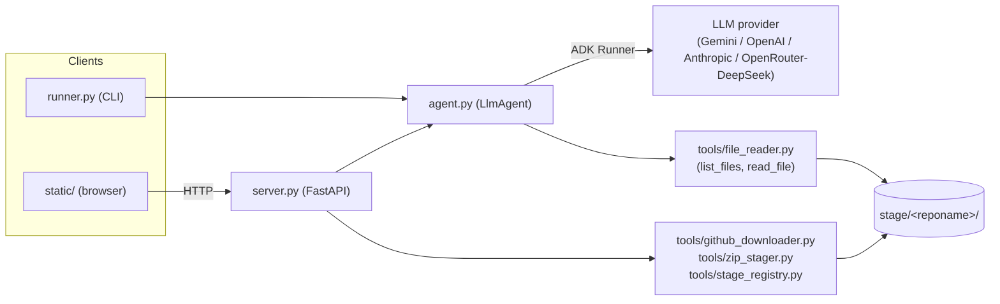
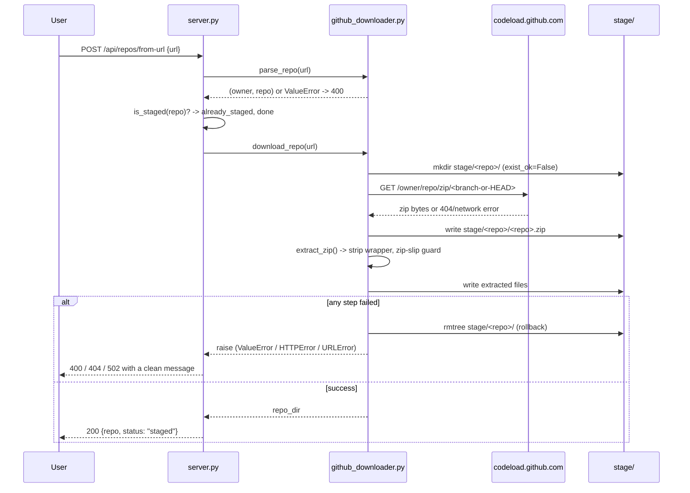
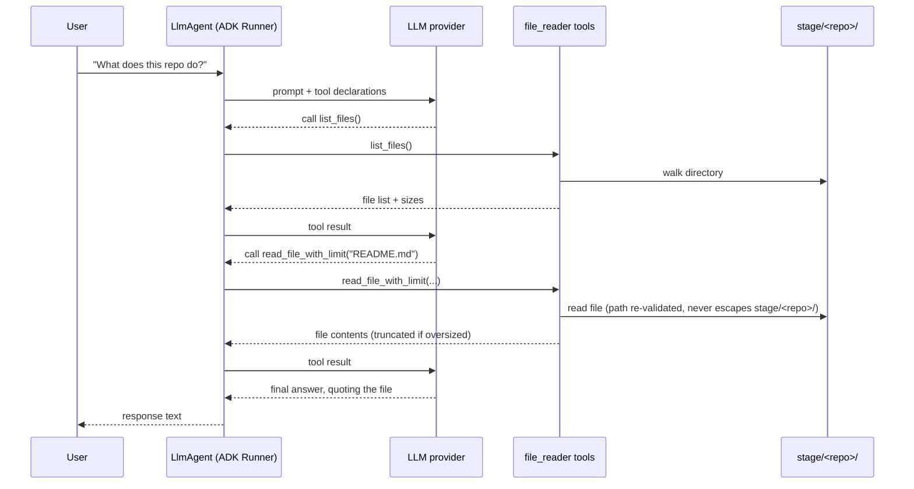

# zdocs-ai — Architecture & Business Logic

## 1. Purpose

zdocs-ai is a documentation/repository assistant. A user gives it a GitHub
repository — by URL or by uploading a `.zip` — and the system downloads,
extracts, and sandboxes that repo on local disk, then lets the user ask an
LLM-backed agent questions about it. The agent answers by calling tools that
list and read files from that one repo's directory; it never has access to
anything else on disk.

Two front doors exist over the same backend: a CLI ([runner.py](../runner.py))
and a small FastAPI web app with a vanilla HTML/JS frontend
([server.py](../server.py), [static/](../static/)).

## 2. High-level architecture



Three layers, deliberately decoupled:

| Layer | Files | Responsibility |
|---|---|---|
| **Entry points** | `runner.py`, `server.py` + `static/` | Accept user input (CLI args, HTTP requests), format output. No staging or agent logic of their own. |
| **Staging (ingestion)** | `tools/github_downloader.py`, `tools/zip_stager.py`, `tools/stage_registry.py` | Turn "a URL" or "an uploaded zip" into a validated, extracted directory under `stage/`. Pure filesystem operations — no LLM involvement. |
| **Agent (querying)** | `agent.py`, `tools/file_reader.py` | An ADK `LlmAgent` sandboxed to exactly one `stage/<reponame>/` directory, exposing `list_files`/`read_file` as tools the model calls itself. |

Staging and querying never share code paths. The agent layer only ever
receives a directory path (`build_agent(stage_dir=...)`); it has no idea
whether that directory came from a GitHub download or a manual upload.

## 3. Directory layout

```
agent.py                     LlmAgent definition (model, system prompt, tools)
runner.py                    CLI entry point + run_turn() (shared by server.py)
server.py                    FastAPI app: staging routes + chat route + static hosting
static/                      Vanilla HTML/CSS/JS frontend (no framework, no build step)
tools/
  file_reader.py             Sandboxed list_files/read_file tools, bound to a stage_dir
  github_downloader.py       URL → zip → extracted files (zip-slip guarded)
  zip_stager.py              Uploaded zip bytes → extracted files (reuses the guard above)
  stage_registry.py          Read-side: list/lookup staged repos
stage/                       One subdirectory per staged repo; the agent's sandbox root
docker-compose.yml           Local dev dependency (MinIO — not yet wired into the app)
Makefile                     `make deps-up/run/test/...` — deps in Docker, app local
test_*.py, conftest.py       Offline, deterministic tests (no network, no LLM calls)
```

## 4. Business logic: staging a repository

"Staging" is the ingestion step — turning user input into files on disk that
the agent can later read. Two entry points converge on identical output.

### 4a. Stage by GitHub URL

`POST /api/repos/from-url` ([server.py](../server.py)) →
`tools/github_downloader.py`:



Business rules encoded here:
- **Only `github.com` URLs are accepted** — `parse_repo()` rejects wrong
  hosts, missing repo segments, sub-paths (`/tree/main`), and any `..`
  traversal attempt in the owner/repo segments.
- **Idempotent re-staging** — if the repo directory already exists, the
  route returns `already_staged` (200) instead of erroring, both via an
  up-front check and by catching the `FileExistsError` race.
- **No partial state on failure** — a bad repo/branch (GitHub 404), a
  network failure, or a malformed/zip-slip archive all trigger a full
  rollback (`shutil.rmtree`) of the half-created directory. Without this, a
  single failed attempt would permanently block ever retrying that repo name
  (the directory would exist but be empty/broken).
- **GitHub errors are translated, not leaked** — `urllib.error.HTTPError`
  (404 → clean 404; other codes → 502) and `URLError` (network failure → 502)
  are caught at the API boundary so a bad input never produces a raw 500 with
  a stack trace.

### 4b. Stage by uploading a `.zip`

`POST /api/repos/upload` → `tools/zip_stager.py`. Same destination shape,
different source:

1. Filename must end in `.zip` (400 otherwise).
2. Bytes are **streamed and counted** as they arrive; the moment the running
   total exceeds `MAX_UPLOAD_BYTES` (`ZDOCS_MAX_UPLOAD_MB`, default 50 MB),
   the request is rejected with 413 — **before anything is written to disk**.
3. `repo_name_from_filename()` derives the target directory name from the
   filename alone: any path components are discarded (so `../../evil.zip`
   safely becomes `evil`), and the result is checked against an allowlist
   (`[A-Za-z0-9._-]`) — rejecting spaces, empty names, and `.`/`..`.
4. `stage_zip_bytes()` — the shared core underneath both `zip_stager.py` and
   (indirectly) `github_downloader.py`'s extraction step — writes the zip,
   calls the **same `extract_zip()`** used by the URL path (imported, not
   duplicated, so the zip-slip guard has exactly one implementation), and
   rolls back on any extraction failure the same way as 4a.

### 4c. What "staged" means (read side)

`tools/stage_registry.py` is the single module anything else uses to answer
"what repos exist / is this one staged / where does it live":

- `list_staged_repos()` — sorted subdirectory names under `stage/`.
- `is_staged(reponame)` — used as a pre-check by both staging routes (for
  idempotency) and as a gate on the chat route (404 if unstaged).
- `staged_repo_dir(reponame)` — resolves and **re-validates** that
  `reponame` (which arrives as a URL path segment, e.g.
  `/api/repos/{reponame}/chat`) cannot escape `stage/` via traversal —
  the same defense-in-depth pattern as the agent's own file sandbox
  (`tools/file_reader.py::_safe_path`).

This module is the intentional seam for future non-local storage (see §7).

## 5. Business logic: querying a staged repository

`POST /api/repos/{reponame}/chat` is where the actual "reading the repo"
happens — but not in `server.py` itself. The route only:

1. Confirms the repo is staged (`is_staged`) → 404 otherwise.
2. Gets or builds an ADK `Runner` for that repo (`_get_or_build_runner`,
   cached in a module-level `dict`, guarded by a lock — one `Runner`/agent
   per repo, built lazily on first chat and reused after).
3. Resolves a `session_id` (client-supplied to continue a conversation, or a
   fresh UUID) so multi-turn context is preserved per browser session.
4. Delegates to `run_turn()` — the same helper the CLI uses
   ([runner.py](../runner.py)) — and returns the final response text.

The actual "scanning" is the **LLM's own tool-calling loop**, driven by the
system instruction in [agent.py](../agent.py):



Rules enforced at this layer:
- **Sandboxing** — `FileReaderTool(stage_dir)` builds closures over one
  resolved directory; the model only ever supplies a relative `filename`,
  and `_safe_path()` re-resolves + rejects anything that would escape it.
- **Context-window safety** — `read_file_with_limit` truncates any file over
  `max_chars` (default 20,000) with an explicit "truncated" marker instead of
  flooding the model's context.
- **Tool schema hygiene** — the closures use `functools.wraps` (to expose the
  real function name/docstring to the model) but explicitly delete
  `__wrapped__` afterward. Left in place, `inspect.signature()` (which ADK
  uses to build the tool schema) would follow it back to the *original*
  function and expose an internal `stage_dir` parameter that the actual
  closure doesn't accept — a real bug hit in testing (DeepSeek attempted to
  pass it, causing a `TypeError`).
- **Model portability** — `ADK_MODEL` is any LiteLLM-compatible string
  (`gemini-2.5-flash`, `openai/gpt-4o`, `anthropic/claude-3-5-sonnet-latest`,
  `openrouter/deepseek/deepseek-chat`, …); the agent code itself never
  branches on provider.

## 6. Cross-cutting concerns

- **No required external infrastructure to run** — session/artifact state is
  in-memory (`InMemorySessionService`, `InMemoryArtifactService`); the only
  durable state is the `stage/` directory tree itself. `auto_create_session=True`
  is required with the installed ADK version — session creation is not
  implicit.
- **Idempotency over hard failure** — every staging path treats "already
  staged" as a success case, not an error, both to make repeated user
  actions (double-clicks, retries) safe and to keep the UI simple.
- **Fail-closed rollback** — every write path that can partially succeed
  (download, upload, extraction) cleans up on failure rather than leaving
  inconsistent state, because a broken `stage/<repo>/` directory is worse
  than no directory: it silently blocks all future retries via the
  `exist_ok=False` guard and would appear as a legitimate "staged" repo in
  listings.
- **Testing philosophy** — the entire suite (`test_*.py`) runs offline: the
  GitHub fetch is monkeypatched at `tools.github_downloader._fetch`, and LLM
  calls are monkeypatched at `server._run_agent_turn` / via a stub `Runner`
  in `test_runner.py`. No test requires network access or an API key.

## 7. Local development: Docker for dependencies, app runs locally

`docker-compose.yml` + `Makefile` split infrastructure from application code:

- `make deps-up` / `deps-down` — start/stop **MinIO** (S3-compatible object
  store) in Docker, the only current "dependency."
- `make install` / `run` / `repl` / `test` — all operate on a local `.venv`;
  the FastAPI app and frontend never run inside a container.

**Important:** MinIO is provisioned but **not yet wired into the
application** — `stage/` remains the sole storage backend today. It exists
as the seed for a future non-local implementation of
`tools/stage_registry.py` (and the corresponding write paths in
`github_downloader.py`/`zip_stager.py`), which is the one module boundary
designed to absorb that change without touching `server.py` or `agent.py`.
A future MinIO backend would still need a "materialize to local scratch
directory" step before `build_agent(stage_dir=...)`, since the ADK file tools
require a real local path — this is a known, deliberately deferred gap, not
an oversight.

## 8. Known limitations

- Single-process, in-memory `Runner` cache in `server.py` — restarting the
  server drops all conversation history (staged repos on disk persist; chat
  sessions do not).
- No authentication/authorization on any route — appropriate for local dev,
  not for exposing this server beyond localhost as-is.
- `list_files` returns every file's size but nothing else (no gitignore
  awareness, no binary detection) — a very large or binary-heavy repo will
  produce a noisy listing.
- Symlinked entries in a zip degrade to plain files on extraction (by
  design — `extract_zip` never creates live symlinks, which is a deliberate
  security tradeoff, not a bug).
